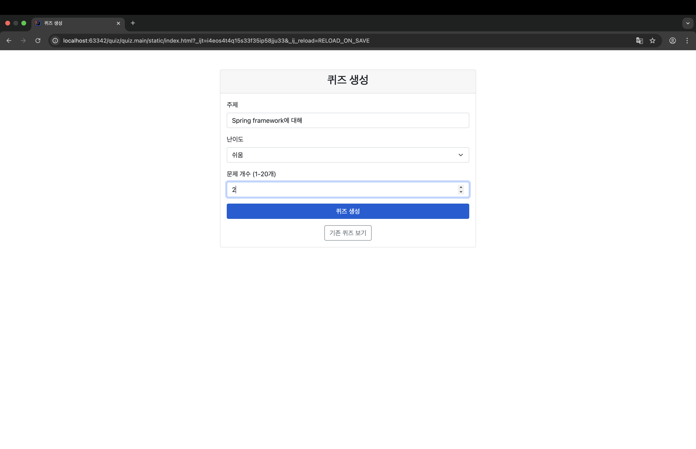
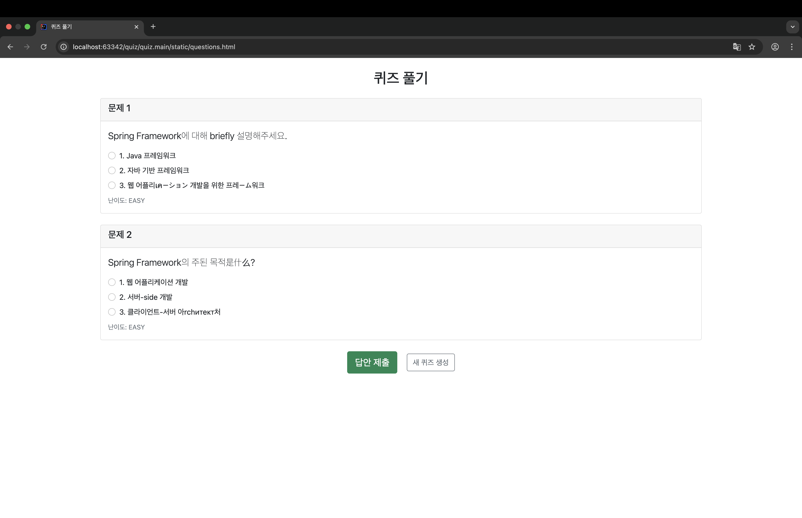
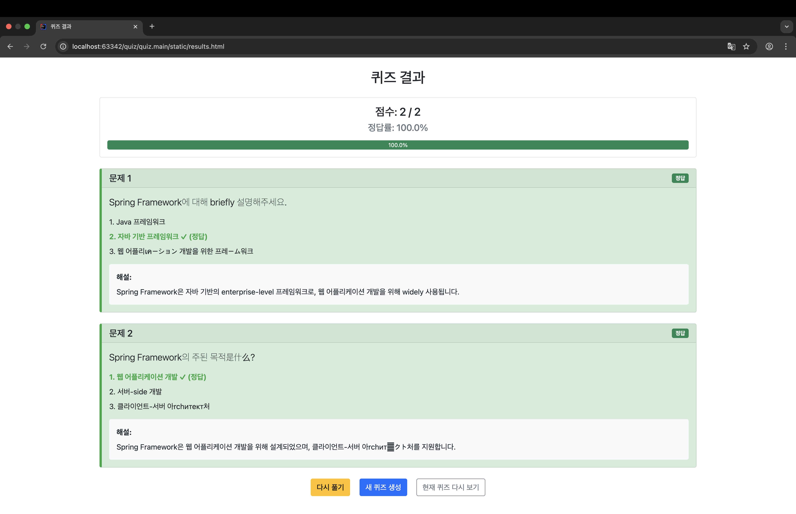

# Introduction
I made local web site to `solve the quiz` for practing to use spring MVC.

|PAGE|PICTURE|INFO|
|:--:|:--:|:--:|
|init||select 3 things(`subject, difficult, quiz count`.)
|solve||solve the quizzes.
|result||check the result. possible to do it again, or new.
---
<video controls src="quiz toy project.mp4" title="Title"></video>
---

### Stack
- ollama llama3:3b
- mysql 9.3.0
- spring boot 3.4.5
- java 17

### Improvement(but not updated)
- `too long`(30seconds more) to wait for generating quizzes.
- `quizzes quality` generated by ai.

